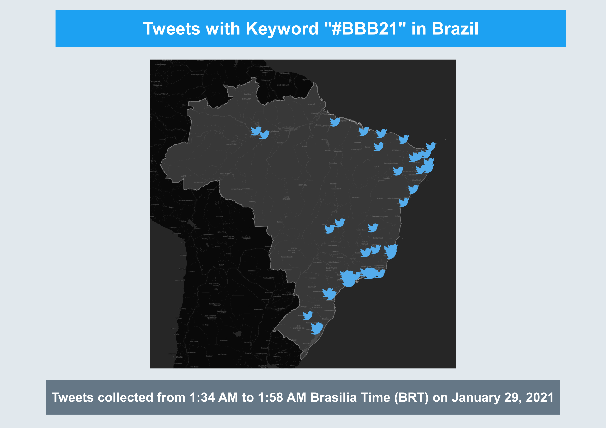

# GEOG458 Lab 2

This lab assignment used Twitter API in order to scrape for geo-tagged tweets. I decided to filter these tweets by keyword, and since "#BBB21" was trending with one million tweets worldwide, I thought it would be interesting to examine where people were tweeting about this hashtag.

"BBB21" is the acronym for Big Brother Brasil 21, Brazil's version of Big Brother in its 21st season. Hence, it made sense that almost all the tweets were in Brazil. Looking at the map, the tweets are clustered along the eastern coast of Brazil.

Considering the majority of Brazil's population lives in big cities closer to the coast, it makes sense that this is where the locations of these geo-tagged tweets would be. With increased population density in these areas,   it is more likely that tweets would appear in those locations. However, this is strong correlation and not causation, and thus could possibly be attributed to other factors.
